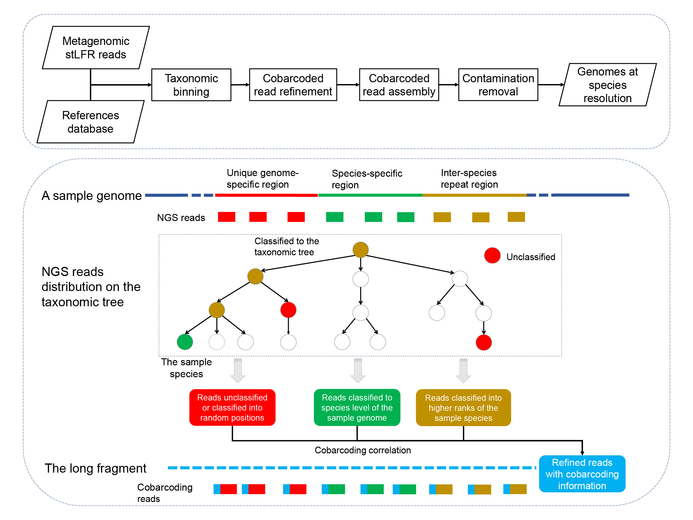

**MetaTrass © BGI-Qingdao**
---

Description:
---
**MetaTrass** is the abbreviation from **Meta**genomics **T**axonomic **R**eads **A**ssembly **S**ingle-**S**pecies. 

MetaTrass is the first metagenome assembly tool implemented by binning-first-assembly-later strategy and it is freely available at https://github.com/BGI-Qingdao/MetaTrass.

MetaTrass integrates the cobarcoding and the reference genome information to achieve high capability of generating high-quality genomes at species level for the human gut microbial commuities.

MetaTrass uses the cobarcoding correlation between short length reads to reduce false positives in conventional taxonomic binning and improve the contiguity of draft assemblies.



Publication:
---
[MetaTrass: A high‐quality metagenome assembler of the human gut microbiome by cobarcoding sequencing](http://www.imeta.science/)

Cited to：

Yanwei Qi, Shengqiang Gu, Yue Zhang, Lidong Guo, Mengyang Xu, Xiaofang Cheng, Ou Wang, Ying Sun, Jianwei Chen, Xiaodong Fang, Xin Liu, Li Deng, and Guangyi Fan. 2022. MetaTrass: a high-quality metagenome assembler of the human gut microbiome by cobarcoding sequencing reads. iMeta e46. 
https://doi.org/10.1002/imt2.46


Change Log:
---
* v1.3.0 (2022-05-27) - Uploaded a demo test data!
* v1.2.0 (2021-08-03) - Finished a version test!
* v1.1.0 (2021-07-09) - Fixed a few bugs
* v1.0.0 (2021-04-13) - Initial release

Branch release:
---
* v1.0.0 (2022-10-26) - a branch realeased! [MetaTrass_lite](https://github.com/QYanwei/MetaTrass_lite)

Dependencies:
---

System requirement:

+ Python3 (version >3.0.0)

+ GCC (version >4.8.1)

Third-party software: 
+ [stLFR_barcode_split](https://github.com/BGI-Qingdao/stLFR_barcode_split.git)
+ [Kraken2](https://github.com/DerrickWood/kraken2)
+ [Seqtk](https://github.com/lh3/seqtk.git)
+ [stlfr2supernova](https://github.com/BGI-Qingdao/stlfr2supernova_pipeline)  
+ [Quast](http://quast.sourceforge.net/quast.html)

How to install:
---
1. MetaTrass can be installed via the git channel:
```
git clone https://github.com/BGI-Qingdao/MetaTrass.git
cd  ./MetaTrass/tools/  && g++ -std=c++11 TABrefiner.cpp -o TABrefiner
```     

2. You can either add MetaTrass's 3rd party dependencies to your system path or put the full path to alias into the folder `MetaTrass/tools/` which can be found by MetaTrass easily. 

Quick start with a demo dataset
---

Get the final assemblies for the demo dataset  :
```
python="/path-to-your/python3"

# download the UHGG kraken dataset 
wget -r -np -nH -erobots=off http://ftp.ebi.ac.uk/pub/databases/metagenomics/mgnify_genomes/human-gut/v1.0/uhgg_kraken2-db/ 
# configure the reference database
$python ./MetaTrass/tool/fa_split_by_taxid.py -reffna ./kraken2-db/library/library*.fna -outdir ./uhgg_kraken2-fa/
$python ./MetaTrass/tool/ref_genome_size.py -refdir ./uhgg_kraken2-fa/
# assemble all species
rawfq1=./MetaTrass/Test/dir1_cleandata/split_reads.1.fq.gz.clean.gz
rawfq2=./MetaTrass/Test/dir1_cleandata/split_reads.2.fq.gz.clean.gz

output=$outdir/Demo
mkdir -p $output

Trass="./MetaTrass/Trass.py"
ref_db="./uhgg_kraken2-db/"
ref_fa="./uhgg_kraken2-fa/"
ref_gz="./uhgg_kraken2-fa/ref_genome_size.txt"

$python $Trass GC -rawfq1 $rawfq1 -rawfq2 $rawfq2 -outdir $output -runnow no

$python $Trass TB -cleanfq1 $output/dir1_cleandata/split_reads.1.fq.gz.clean.gz \
                  -cleanfq2 $output/dir1_cleandata/split_reads.2.fq.gz.clean.gz \
		   -thread 10 -sample $sample -ref_db $ref_db -genome_size $ref_gz -outdir $output -runnow yes
		   
$python $Trass AP -outdir $output -ref_fa $ref_fa -thread 10 -parallel 10 -runnow yes 
```


Usage 0.1:  Configure the reference database:
---
1. **The reference database** for kraken2 includes a folder that holds the database. 
   Databases are pre-built, including the required hash.k2d, opts.k2d, and taxo.k2d files.
     * For **Human Gut**:  
       We recommend the UHGG taxonomy database which can be downloaded from [MGnify Genomes](http://ftp.ebi.ac.uk/pub/databases/metagenomics/mgnify_genomes/human-gut/v1.0/uhgg_kraken2-db/).  
       **uhgg_kraken2-db/**  catalog
	```
				├── [472K]  database100mers.kmer_distrib  
				├── [441K]  database150mers.kmer_distrib  
				├── [421K]  database200mers.kmer_distrib  
				├── [403K]  database250mers.kmer_distrib  
				├── [540K]  database50mers.kmer_distrib  
				├── [4.0K]  library    
				│   ├── [ 11G]  library.fna  
				│   └── [ 31M]  prelim_map.txt  
				├── [ 16G]	hash.k2d
				├── [  48]	opts.k2d  
				├── [473K]	taxo.k2d  
				└── [4.0K]  taxonomy  
				    ├── [310K]  names.dmp  
				    ├── [127K]  nodes.dmp  
				    └── [ 31M]  prelim_map.txt  
	```

     * For [**Zymo Community Standards 10 Mock**](https://github.com/LomanLab/mockcommunity):  
       You can download the reference database from [Mock Community](https://lomanlab.github.io/mockcommunity/mc_databases.html)

     * Or for **Customized Microbiome** grouping:  
       Please check the NCBI official species taxonomic ID to add it to the NCBI taxonomy.  
       To build a reliable species tree, please use non-redundant genomes for the references. :warning:

2. **The reference genome** for refining the contigs. Should be kept with the reference database.
     * Split library.fna which can be found in uhgg_kraken2-db/library/ (see above) to single species fasta file.
       You can use the script (MetaTrass/tool/fa_split_by_taxid.py). 
       
     	```
		python3 /path/to/MetaTrass/tool/fa_split_by_taxid.py -reffna /path/to/kraken2-db/library/library*.fna -outdir /path/to/single-genome-fa/ 
		```
     
     * If you have already the single species fasta file, then please use taxid_genomic.fa as the filename, such as 1104_genomic.fa. 
	
3. **The reference genome size** information table :warning:
      * Get each single species genome size as the configure file with two columns. For example :
	
		|taxid	 | genome size(bp)|
		| :----- | ----: |
		|1000|2176737|
		|1001|6092914|
		|1002|3864718|
		|1006|2741290|
		|1007|3003526|
		|1008|1739566|
		|1009|1809170|
		|1010|4528241|
		|1011|2149385|
		|1013|2260187|

      * Please note that the genome size table file has no header line. :warning: :warning: :warning:
      * Please refer to the tables in MetaTrass/Config/all_single_species_genome_size.uhgg.txt. 
      * You can use the script (MetaTrass/tool/ref_genome_size.py) to get species genome size information and generate the above table. 
      
        	python3 /path/to/MetaTrass/tool/ref_genome_size.py -refdir /path/to/single-genome-fa/ 


Usages 0.2: Assemble all species.
---
We provide flexible commands and detailed usage for users.  
Usages:

	
	$ python /path/to/software/MetaTrass/Trass.py -h

	            ...:::=== MetaTrass v1.20.0 ===:::...
	    =================================================
	               Metagenomic Taxonomic Reads
	                 Assembly Single-Species
	    =================================================
	    Combination modules:
	       GC              ->  Get stLFR Cleandata. 
	                           GC is the combination of SplitBarcode and GetCleandata commands.
	       TB              ->  Taxonomic Reads And Co-Barcoding Reads Refining (TABrefiner)
	       			   TB is the combination of Kraken2Taxon, TXACBrefiner, and ReadID2Fastq commands.
	       AP              ->  Single-species Assembly and Contigs Purifying
	                           AP is the combination of MetaAssembly and ContigPurify commands
	
	    Independent command :
	       SplitBarcode    ->  Convert barcode sequences to digital code
	       GetCleandata    ->  Clean data filtered by SOAPfilter
	       Kraken2Taxon    ->  Total taxonomic reads using references database by Kraken
	       TXACBrefiner    ->  Refining read id using yaxonomic information and superior co-barcoding set
	       ReadID2Fastq    ->  Convert the refined read id from total fastq file to each speices
	       MetaAssembly    ->  Co-barcoding genome assembly using SUPERNOVA
 	       ContigPurify    ->  Purify the initial assembly sequences to generate final MAGs based on the references

 	   # for command specific help info
	       python3 Trass.py GC -h
	       python3 Trass.py TB -h
	       python3 Trass.py AP -h
	
	       python3 Trass.py SplitBarcode -h
	       python3 Trass.py GetCleandata -h
	       python3 Trass.py Kraken2Taxon -h
	       python3 Trass.py TXACBrefiner -h
	       python3 Trass.py ReadID2Fastq -h
	       python3 Trass.py MetaAssembly -h
	       python3 Trass.py ContigPurify -h
	


Usage for each combination module:

* 1. **G**etting **C**leanData 
	
	```	
	> python Trass.py GC -h
	usage: Trass.py GC [-h] -rawfq1 RAWFQ1 -rawfq2 RAWFQ2 [-thread THREAD] -outdir OUTDIR [-runnow RUNNOW]

	Get stLFR Clean data

	optional arguments:
	  -h, --help      show this help message and exit
	  -rawfq1 RAWFQ1  Paired-end data: raw 1 fastq.gz
	  -rawfq2 RAWFQ2  Paired-end data: raw 2 fastq.gz
	  -thread THREAD  the number of threads
	  -outdir OUTDIR  Output folder
	  -runnow RUNNOW  Run this script immediately

	```
	
* 2. **T**axonomic Reads **A**nd Co-**B**arcoding Reads **Refining**  (TABrefiner)
	
	```	
	> python Trass.py TB -h
	usage: Trass.py TB [-h] -cleanfq1 CLEANFQ1 -cleanfq2 CLEANFQ2 [-thread THREAD] [-parallel PARALLEL] -sample SAMPLE -ref_db REF_DB -genome_size GENOME_SIZE [-max_depth 		MAX_DEPTH] [-min_depth MIN_DEPTH] [-pe_length PE_LENGTH] -outdir OUTDIR [-runnow RUNNOW]

	Taxonomic and Barcoding

	optional arguments:
	  -h, --help            show this help message and exit
	  -cleanfq1 CLEANFQ1    Paired-end data: cleanfq1 fastq.gz
	  -cleanfq2 CLEANFQ2    Paired-end data: cleanfq2 fastq.gz
	  -thread THREAD        Kraken parameter
	  -parallel PARALLEL    The number of parallel species
	  -sample SAMPLE        Output FileName Prefix
	  -ref_db REF_DB        Taxonomy references database
	  -genome_size GENOME_SIZE
				Reference genome size table file
	  -max_depth MAX_DEPTH  Species Maximum-Depth Required Assembly
	  -min_depth MIN_DEPTH  Species Minimum-Depth Required Assembly
	  -pe_length PE_LENGTH  PE read length of sequencing data
	  -outdir OUTDIR        Output folder
	  -runnow RUNNOW        Run this script immediately
  
	```

* 3. Single-species **A**ssembly and Contigs **P**urifying  
	
	```
	> python Trass.py AP -h
	usage: Trass.py AP [-h] [-maprate MAPRATE] [-memory MEMORY] [-maxreads MAXREADS] [-pairdepth PAIRDEPTH] [-PCT PCT] [-IDY IDY] -ref_fa REF_FA [-thread THREAD]
	[-parallel PARALLEL] [-max_depth MAX_DEPTH] [-min_depth MIN_DEPTH] -outdir OUTDIR [-runnow RUNNOW]

	Assembly and Purifying

	optional arguments:
	  -h, --help            show this help message and exit
	  -maprate MAPRATE      mapping ratio (default=8)
	  -memory MEMORY        number of memory use(GB,default = 150)
	  -maxreads MAXREADS    maximumreads for supernova(default = 2140000000)
	  -pairdepth PAIRDEPTH  filter less X pair barcode reads(default = 2)
	  -PCT PCT              Threshold of contig lnegth(0-1)
	  -IDY IDY              Threshold of IDY (80 - 100)
	  -ref_fa REF_FA        Taxonomic reference genome fasta folder
	  -thread THREAD        The number of assembly thread of each species
	  -parallel PARALLEL    The number of parallel assembly of single species
	  -max_depth MAX_DEPTH  Species Maximum-depth required assembly
	  -min_depth MIN_DEPTH  Species Minimum-depth required assembly
	  -outdir OUTDIR        Output folder
	  -runnow RUNNOW        Run this script immediately

	```


Input Sequencing files:
---
1. **For stLFR sequencing data**
     * 1. Raw data 
     
       If you are using raw data, please split the barcode first to get clean data.
       We offer the _MetaTrass GC_ function to gain clean data
       ```
       python3 /path/to/MetaTrass/Trass.py GC -rawfq1 rawfq.1.fq.gz -rawfq2 rawfq.2.fq.gz -outdir /path/to/output/ -runnow yes 
       
       ```
	
     * 2. Clean data 
     
       If you have clean data, please directly run the MetaTrass's TB and AP steps.
	
2. **For 10X Chromium sequencing data**	
     * 1. Raw data:
     
       If you have 10X Chromium data, please convert them to stLFR format.
     		
     * 2. Clean data: like publicated dataset.  
     	Using Athena MOCK20 sequencing data ([ATCC MOCK20 10X data](https://www.ncbi.nlm.nih.gov/sra/SRX3727063%5baccn%5d)) as an examples. 
	
        **_Converting_ 10X data**
	
		- Read1 of 10X reads: **SRR6760785_1.fastq.gz** 
		
		*The barcode sequence is located on the query name within read1*
		
		```
		@SRR6760785.142 K00374:82:hkjyvbbxx:5:1113:28209:40702 length=112
		GCCACCTCGGCGATCTCGGGATCGACATGCGCGGTCTCGATGGTGAAGTCGGGCCCTTCCGGCAGCAGGTAGCCGATCTCGCGCAGGAAGGCGGTGTACTCTCTAAGGCTCG
		+SRR6760785.142 K00374:82:hkjyvbbxx:5:1113:28209:40702 length=112
		JJJJJJJJJJJJJJJJJJJJJJJJJJJJJJJJJJJJJJJJJJJJJJJJJJJJJJJJJJJJJJJJJJJJJJJJJJJJJJJJJJJJJJJJJJJJJJJJJJJJJJJJJJJJJJJJ
		@SRR6760785.143 K00374:82:hkjyvbbxx:5:2220:18690:47172_AAACACCAGACAATAC length=111
		CAAGCAAACAGAAGAATGAACAAAATGTGCCTGCTTGTCGGACAAAGGTCTCAATATGCTATTCCCTTTATCTTAAATCTATTTTATCACGGCTCCCTATGTGGCATCCAA
		+SRR6760785.143 K00374:82:hkjyvbbxx:5:2220:18690:47172_AAACACCAGACAATAC length=111
		JJJJJJJJJJJJJJJJJJJJJJJJJJJJJJJJJJJJJJJJJJJJJJJJJJJJJJJJJJJJJJJJJJJJJJJJJJJJFJJJJJJJJJJFJJJJJJJJJJJJJJJJJJJJFAJ
		@SRR6760785.144 K00374:82:hkjyvbbxx:5:1212:15016:44078_AAACACCAGCGATATA length=111
		TCCTCAACGAAGTGCGGGATCTGAAAGCCAAGAATTTCCGCGAGGTAACGCTGCTGGGGCAGAATGTAAACTCCTACCGATACGAACAAAACGGGCGGATCATCCGCTTCC
		+SRR6760785.144 K00374:82:hkjyvbbxx:5:1212:15016:44078_AAACACCAGCGATATA length=111
		JJJJJJJJJJJJJJJJJJJJJJJJJJJJJJJJJJJJJJJJJJJJJJJJJJJJJJJJJJJJFJJJJJJJJJJJJJJJJJJJJJJJJFJJJJJJJJJJJJJJJJJJJJJJJJJ
		```
		- Read2 of 10X reads: **SRR6760785_2.fastq.gz** 
		
		*There is no barcode information within read2* 
		
		```
		@SRR6760785.142 K00374:82:hkjyvbbxx:5:1113:28209:40702 length=132
		CAGGGGTTGCAGGTGGATGTACGTCTGGCCGAGTTCGTGGCTCGCGAGGCGCTGCCGGGCACCGGTGTCAGCGAGGAAGCCTTCTGGGGAGGCCTCGCCGACACGGTGCGTACTCTCGGGCCGCGGAACCGC
		+SRR6760785.142 K00374:82:hkjyvbbxx:5:1113:28209:40702 length=132
		FFFJJJJJJJJJJJJJJJJJJJJJJJJJJJJJF<FJJFJJJAJJJJFJJJJJJJJJJJFJFFJJJJJFAJJJJJJJJJJJAAFAFJFJJJJJJJFJJJJJAJFJJJJJJJJJJJ<AJJJJJJFJFFJJJJJJ
		@SRR6760785.143 K00374:82:hkjyvbbxx:5:2220:18690:47172_AAACACCAGACAATAC length=133
		CTGCACACGCTTTTCTATTTCCTGAAAGTTATATTCCATAATCCCTGATTTGTTCGATATATTAACTACTGTTTCTTGCCACAATATTGAAAAAAGCAGTCAGCAAACACACTAACTGCTTTATTTTCAGTTT
		+SRR6760785.143 K00374:82:hkjyvbbxx:5:2220:18690:47172_AAACACCAGACAATAC length=133
		FFFJJJJJJJJJJJJJJJJJJJJJJJJJJJJJJJJJJJJJFJJJJJJAJJJJJJJFFJJJJJJJJJJJJJJJJJFJJJJAFJJJJJJJFJFFFFJJFJJJJAA7F<AAFFFJJJFJJFJJJJ<FJJA---<FJ
		@SRR6760785.144 K00374:82:hkjyvbbxx:5:1212:15016:44078_AAACACCAGCGATATA length=100
		TGTCCCTCTTGTTGCTCTCCTCGCTCAGGCGATTCTGGAGGGCTATCATCCGATCCAGACGGGCGAGCTTTACCTCTTCGAGTACATCGTCCACAAGGTG 
		+SRR6760785.144 K00374:82:hkjyvbbxx:5:1212:15016:44078_AAACACCAGCGATATA length=100
		FFFJJJJJ-FJJJJJJJFJJ7JJFFJJJJJJJJJJJJJ<JJJJJJJJ7JJJJJJJJJJFAJJFJF<JJJ7JFJJJJ<FFJJAAJJAFFJJJJJJ<AFJAJ
		```
        **_To_ stLFR data** 
	
		- Read1 of stLFR reads: **SRR6760785_1.stlfr.fastq.gz**
		 
		*The barcode information is appended at the header line. #xxx_xxx_xxx part is the barcode*
		
		``` 
		@SRR6760785.142#0_0_0/1
		GCCACCTCGGCGATCTCGGGATCGACATGCGCGGTCTCGATGGTGAAGTCGGGCCCTTCCGGCAGCAGGTAGCCGATCTCGCGCAGGAAGGCGGTGTACTCTCTAAGGCTCG
		+
		JJJJJJJJJJJJJJJJJJJJJJJJJJJJJJJJJJJJJJJJJJJJJJJJJJJJJJJJJJJJJJJJJJJJJJJJJJJJJJJJJJJJJJJJJJJJJJJJJJJJJJJJJJJJJJJJ
		@SRR6760785.143#AAACACCAGACAATAC/1
		CAAGCAAACAGAAGAATGAACAAAATGTGCCTGCTTGTCGGACAAAGGTCTCAATATGCTATTCCCTTTATCTTAAATCTATTTTATCACGGCTCCCTATGTGGCATCCAA
		+
		JJJJJJJJJJJJJJJJJJJJJJJJJJJJJJJJJJJJJJJJJJJJJJJJJJJJJJJJJJJJJJJJJJJJJJJJJJJJFJJJJJJJJJJFJJJJJJJJJJJJJJJJJJJJFAJ
		@SRR6760785.144#AAACACCAGCGATATA/1
		TCCTCAACGAAGTGCGGGATCTGAAAGCCAAGAATTTCCGCGAGGTAACGCTGCTGGGGCAGAATGTAAACTCCTACCGATACGAACAAAACGGGCGGATCATCCGCTTCC
		+
		JJJJJJJJJJJJJJJJJJJJJJJJJJJJJJJJJJJJJJJJJJJJJJJJJJJJJJJJJJJJFJJJJJJJJJJJJJJJJJJJJJJJJFJJJJJJJJJJJJJJJJJJJJJJJJJ
		``` 

		- Read2 of stLFR reads: **SRR6760785_2.stlfr.fastq.gz** 
		
		*The barcode information is appended at the header line. #xxx_xxx_xxx part is the barcode* 

		``` 
		@SRR6760785.142#0_0_0/2
		CAGGGGTTGCAGGTGGATGTACGTCTGGCCGAGTTCGTGGCTCGCGAGGCGCTGCCGGGCACCGGTGTCAGCGAGGAAGCCTTCTGGGGAGGCCTCGCCGACACGGTGCGTACTCTCGGGCCGCGGAACCGC
		+
		FFFJJJJJJJJJJJJJJJJJJJJJJJJJJJJJF<FJJFJJJAJJJJFJJJJJJJJJJJFJFFJJJJJFAJJJJJJJJJJJAAFAFJFJJJJJJJFJJJJJAJFJJJJJJJJJJJ<AJJJJJJFJFFJJJJJJ
		@SRR6760785.143#AAACACCAGACAATAC/2
		CTGCACACGCTTTTCTATTTCCTGAAAGTTATATTCCATAATCCCTGATTTGTTCGATATATTAACTACTGTTTCTTGCCACAATATTGAAAAAAGCAGTCAGCAAACACACTAACTGCTTTATTTTCAGTTT
		+
		FFFJJJJJJJJJJJJJJJJJJJJJJJJJJJJJJJJJJJJJFJJJJJJAJJJJJJJFFJJJJJJJJJJJJJJJJJFJJJJAFJJJJJJJFJFFFFJJFJJJJAA7F<AAFFFJJJFJJFJJJJ<FJJA---<FJ
		@SRR6760785.144#AAACACCAGCGATATA/2
		TGTCCCTCTTGTTGCTCTCCTCGCTCAGGCGATTCTGGAGGGCTATCATCCGATCCAGACGGGCGAGCTTTACCTCTTCGAGTACATCGTCCACAAGGTG
		+
		FFFJJJJJ-FJJJJJJJFJJ7JJFFJJJJJJJJJJJJJ<JJJJJJJJ7JJJJJJJJJJFAJJFJF<JJJ7JFJJJJ<FFJJAAJJAFFJJJJJJ<AFJAJ
		``` 
		
        **_Refering_ the shell code**: 
		``` 
		gzip -dc  SRR6760785_1.fastq.gz |awk -F ' |_' '{ if(NR%4==1){ if(NF==4){printf("%s#%s/1\n",$1,$3); } else {printf("%s#0_0_0/1\n",$1);}} else if (NR%4==2 || NR%4==0) {print $0;} else{print "+";} } ' |gzip - > SRR6760785_1.stlfr.fastq.gz &
		gzip -dc  SRR6760785_2.fastq.gz |awk -F ' |_' '{ if(NR%4==1){ if(NF==4){printf("%s#%s/2\n",$1,$3); } else {printf("%s#0_0_0/2\n",$1);}} else if (NR%4==2 || NR%4==0) {print $0;} else{print "+";} } ' |gzip - > SRR6760785_2.stlfr.fastq.gz &
		```  

MetaTrass parameters and notices:
---
* Required parameter:
1. -rawdata input: raw stLFR sequencing data without splitting the barcode.
2. -cleandata input: Paired-end clean data, should split the barcode from sequences or convert to stLFR format.
3. -outdir: the output path to the storage of your results.
4. -thread: a) in TB option, please set the maximum threads. b)in AP option, please make the value of thread * parallel equal to the maximum threads.
5. -runnow: decide whether run the command line right now or not.
6. -ref_db: assigning the prepared kraken2 reference database.
7. -genome_size: all single-species genome size table followed by reference of your microbiome.
8. -parallel: determining the number of species to assemble at one time, coordinate with the number of threads to make the decision.

* Control parameter:
1. -min_depth: filtering extreme low depth species, if you want to skip (default: 10).
2. -max_depth: limiting the reads number of species by barcode unit when over the threshold depth (default: 300).
3. -PCT: the purifying step required, threshold of contig length (default: 0.5, range: 0-1).
4. -IDY: the purifying step required, threshold of IDY (default: 1, range: 80 - 100).


* Notices
1. extreme-high depth species: 

MetaTrass embedded Supernova as the assembly tool, which gains a longer continuity of genome but takes a longer assembly time compared to other tools. If meet the ultra-high depth species, it will fail to assemble because Supernova has a strict monitoring mechanism of input coverage. In particular, we recommend using other linked-reads' assemblers, such as cloudSPAdes, to re-assemble these species or you can use [MetaTrass_lite](https://github.com/QYanwei/MetaTrass_lite)..

2. barcode with high interspecies shared: 

Some co-barcoding or linked-reads data may crash, which means barcodes are shared by several species. We developed a tool to remove those reads with shared barcodes, named TABrefiner_NOS. You can alias the MetaTrass/tools/TABrefiner_NOS to MetaTrass/tools/TABrefiner. Using the command "ln -s TABrefiner_NOS TABrefiner" is easy to replace. Please keep both versions of TABrefiner.

3. others co-barcoding data:

If you have linked-reads data, please convert them to stLFR format. Since the number of long fragments with the same barcode in linked-reads is greater than that of stLFR reads, more false-positive reads are introduced into the co-barcoding refined read sets, leading to the unsuccessfully assembling of several species by Supernova. We recommend using other co-barcoding assemblers, such as CloudSPAdes, to re-assemble these species or you can use [MetaTrass_lite](https://github.com/QYanwei/MetaTrass_lite)..

Output files:
---
Examples of output folder structure:

```
	.
	├── [4.0K]  all_command_shell/ 
	│   ├── [ 911]  run.log 
	│   ├── [ 419]  stp1.1.splitbarcode.sh 
	│   ├── [ 435]  stp1.2.getcleandata.sh 
	│   ├── [ 631]  stp2.1.kraken2taxon.sh 
	│   ├── [ 355]  stp2.2.TXACBrefiner.sh 
	│   ├── [155K]  stp2.3.ReadID2Fastq.sh 
	│   ├── [155K]  stp3.1.MetaAssembly.sh 
	│   └── [101K]  stp3.2.ContigPurify.sh 
	├── [4.0K]  dir1_cleandata/ 
	│   ├── [ 106]  barcode_freq.txt 
	│   ├── [  98]  lane.lst 
	│   ├── [ 118]  split_reads.1.fq.gz.clean.gz 
	│   ├── [ 118]  split_reads.2.fq.gz.clean.gz  
	│   ├── [ 109]  split_read_stat.log  
	│   └── [  98]  stat.txt  
	├── [4.0K]  dir2_taxonomy/
	│   ├── [ 20K]  ID2FQ/
	│   ├── [4.0K]  kraken/
	│   └── [ 20K]  SSRlist/
	└── [4.0K]  dir3_assembly/
	    ├── [4.0K]  purify/
	    ├── [4.0K]  quast/
	    └── [4.0K]  supernova/

	10 directories, 14 files
```   

    
MetaTrass performance
---

|Sample	|Base number (Gb)|Peak RAM usage (Gb)|CPU max (thread)|Time (min)|
| :----- | ----: | :----- | ----: | :----- |
|H_Gut_Meta01|34.48|50.2|16|5,145 |
|H_Gut_Meta02|35.33|55.1|16|2,631 |
|H_Gut_Meta03|37.88|55.5|16|3,147 |
|P_Gut_Meta01|97.20|71.0|16|8,363 |


Contributing:
---
* Author Contact: dengli1@genomics.cn; qiyanwei1@genomics.cn; guolidong@genomics.cn;

License:
---
* GNU General Public License v3.0

Issue:
---
* Please submit issues on the [github page for MetaTrass](https://github.com/BGI-Qingdao/MetaTrass/issues).


